

  

## 简介

本系统基于 [OHTTPS](https://ohttps.com) 参照进行开发，使用`NestJS` + `TypeORM` 构建开发接口，前端使用 `TDesign Starter VUE3` 进行基础模板。

面向个人、团队及企业，提供一站式证书申请服务，自动签发更新，自动部署同步，定时证书监控，实现简单、高效、快捷的证书自动化服务。

## 预览

*   官网 [Certeasy.cn](https://www.certeasy.cn)， 单一静态页
*   控制台 [Certeasy App](https://app.certeasy.cn)，证书管理功能集合
*   文档 [Certeasy Docs](https://docs.certeasy.cn)， 使用`vitepress`构建

## 截图

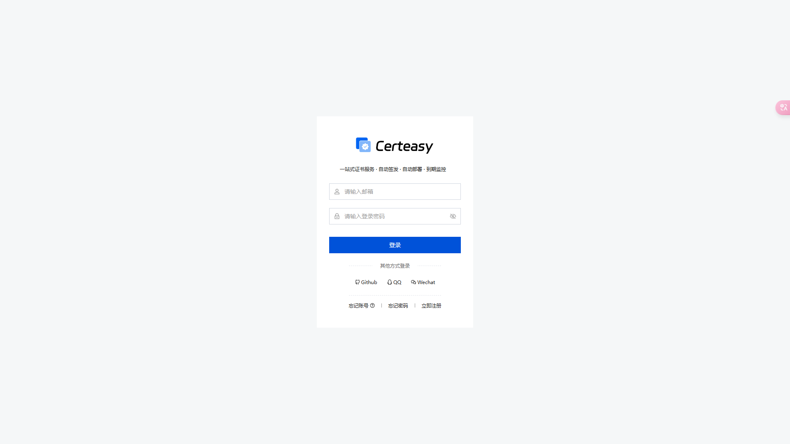

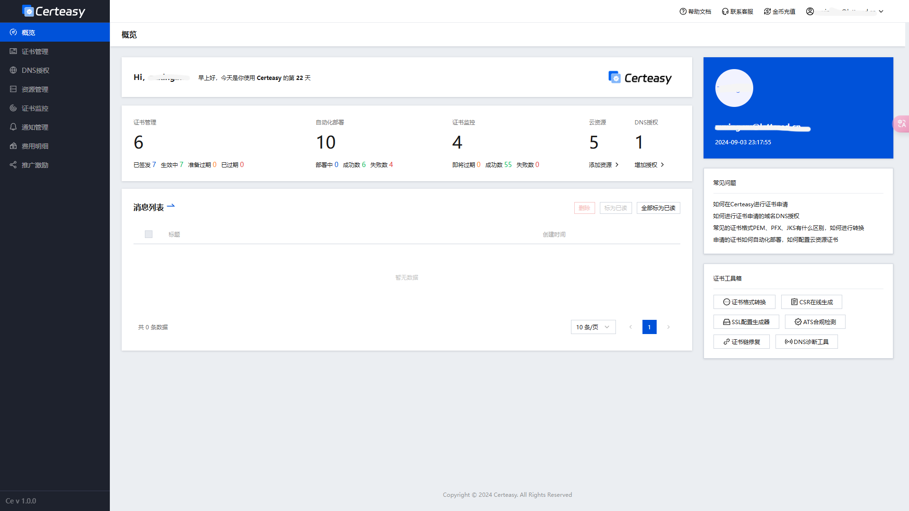

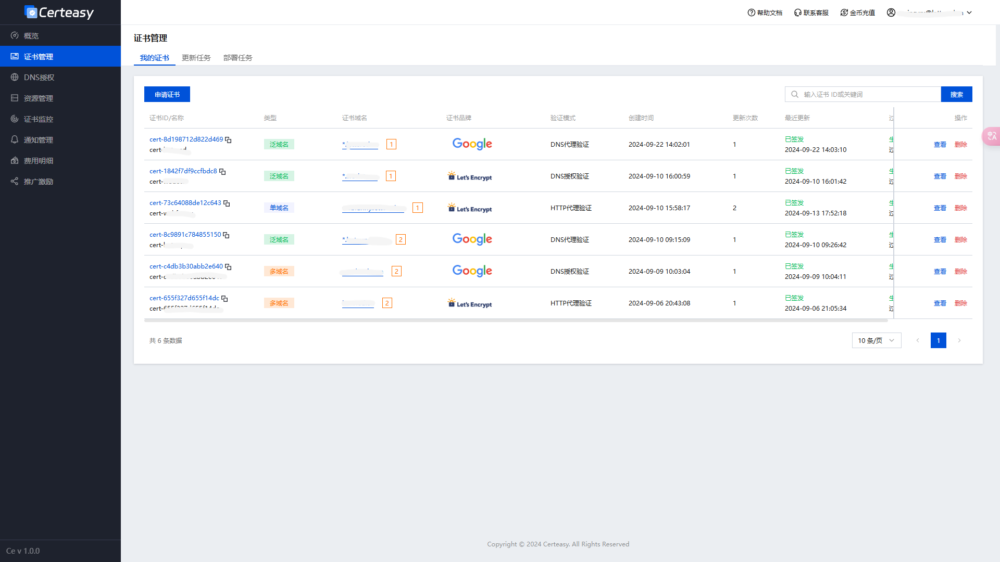

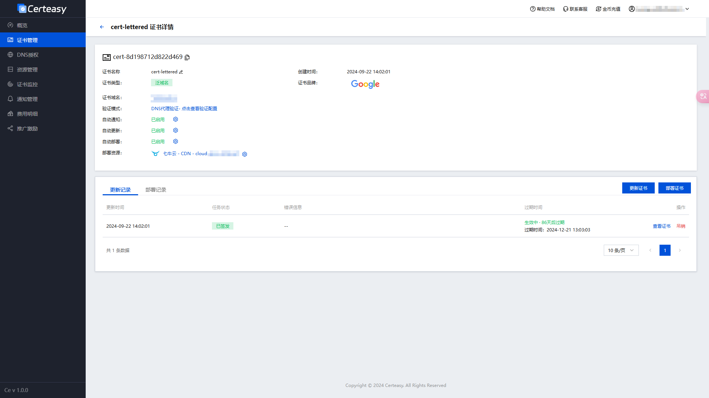

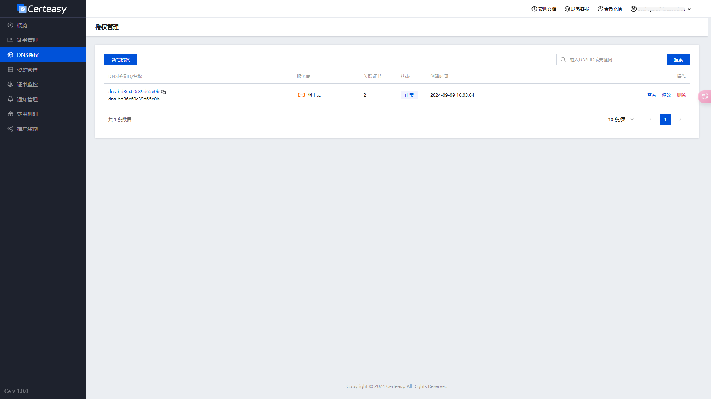

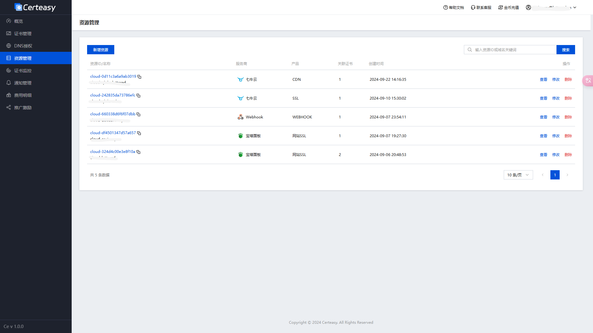

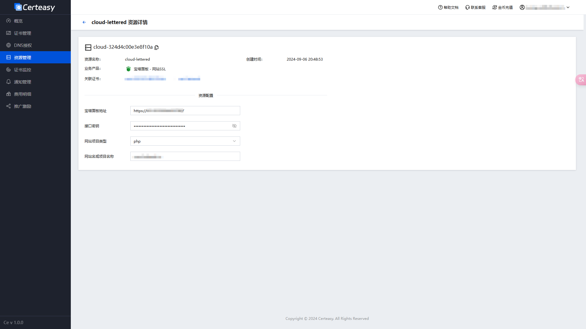

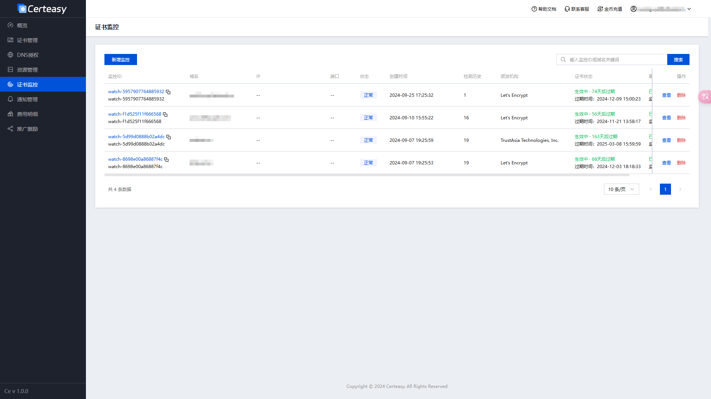

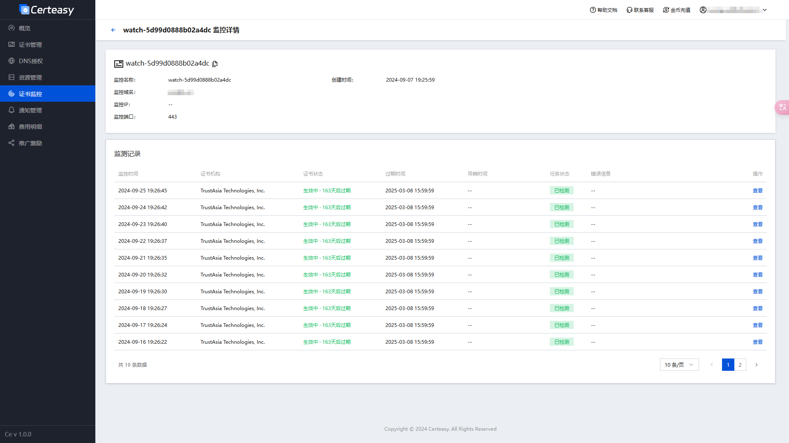

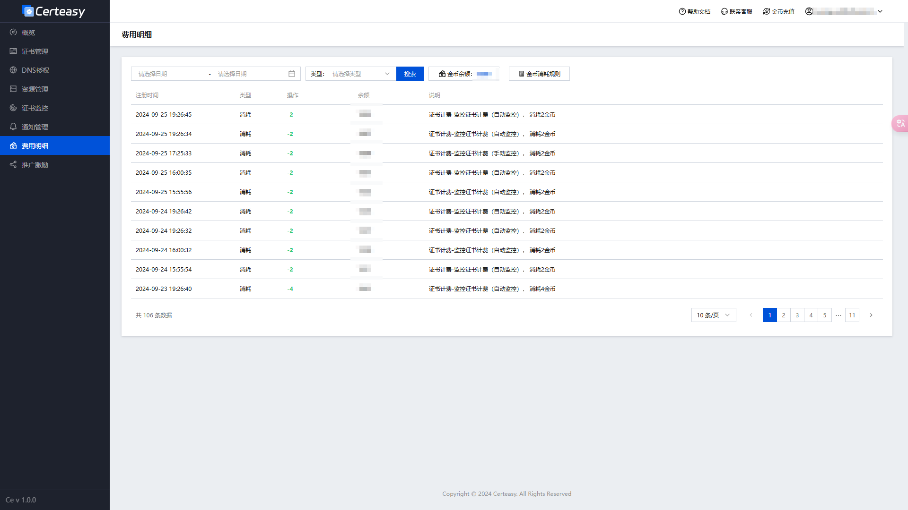

## 系列文章

*   [Nestjs构建Certeasy证书自动化平台 - 介绍](https://juejin.cn/post/7418522323756433434)
*   [Nestjs构建Certeasy证书自动化平台 - 框架搭建](https://juejin.cn/post/7418546982195003419)
*   [Nestjs构建Certeasy证书自动化平台 - 业务实现（登录注册）](https://juejin.cn/spost/7418546982195527707)
*   Nestjs构建Certeasy证书自动化平台 - 业务实现（证书模块）
*   Nestjs构建Certeasy证书自动化平台 - 业务实现（DNS授权模块）
*   Nestjs构建Certeasy证书自动化平台 - 业务实现（云资源模块）
*   Nestjs构建Certeasy证书自动化平台 - 业务实现（证书监控模块）
*   [Nestjs构建Certeasy证书自动化平台 - 业务实现（用户模块）](https://juejin.cn/post/7418548134592659465)
*   Nestjs构建Certeasy证书自动化平台 - 业务实现（通知模块）
*   Nestjs构建Certeasy证书自动化平台 - 业务实现（充值模块）

## 开源

*   前端: [GitHub: certeasy\_tdesign\_open](https://github.com/CerteasyTeam/certeasy_tdesign_open)
*   后端: [GitHub: certeasy\_nest\_open](https://github.com/CerteasyTeam/certeasy_nest_open)

## 联系

wechat: zuxcloud

Email: <a href="mailto:zuxing.xu@lettered.cn">zuxing.xu@lettered.cn</a>

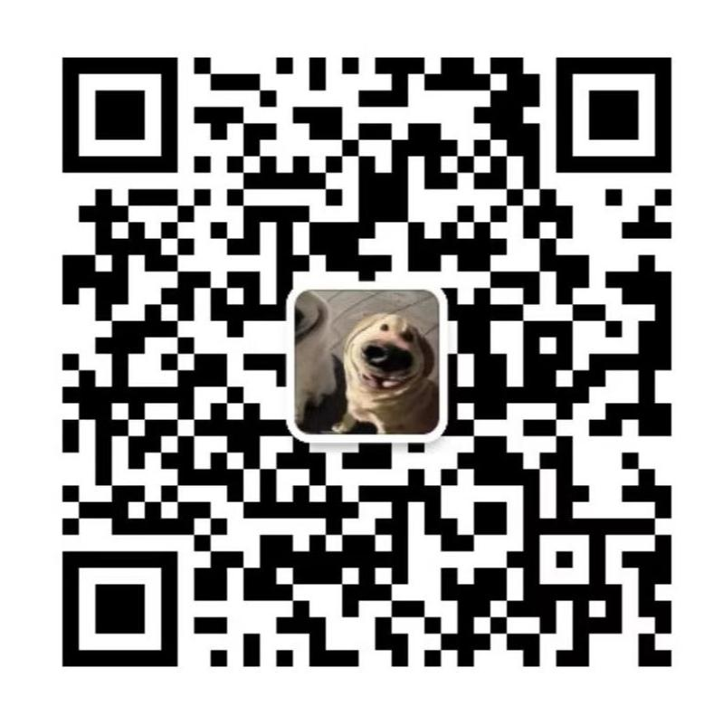
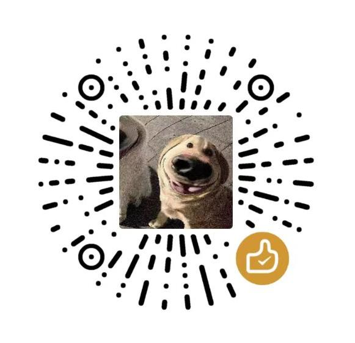

# 使用条款

本项目的代码仅供学习、研究和个人使用。未经许可，禁止将该软件用于商业用途，包括但不限于：
- 作为商业产品的一部分使用；
- 提供商业服务；
- 直接或间接地通过该软件获利。

如果有商业用途需求，请联系作者。

